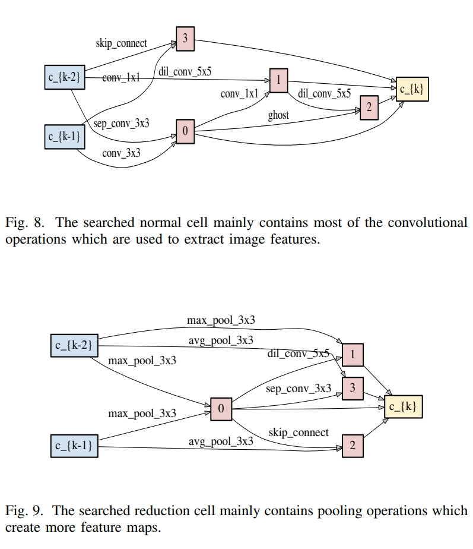
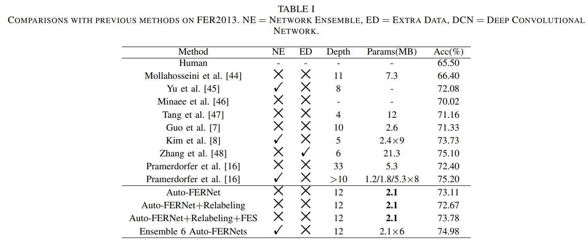
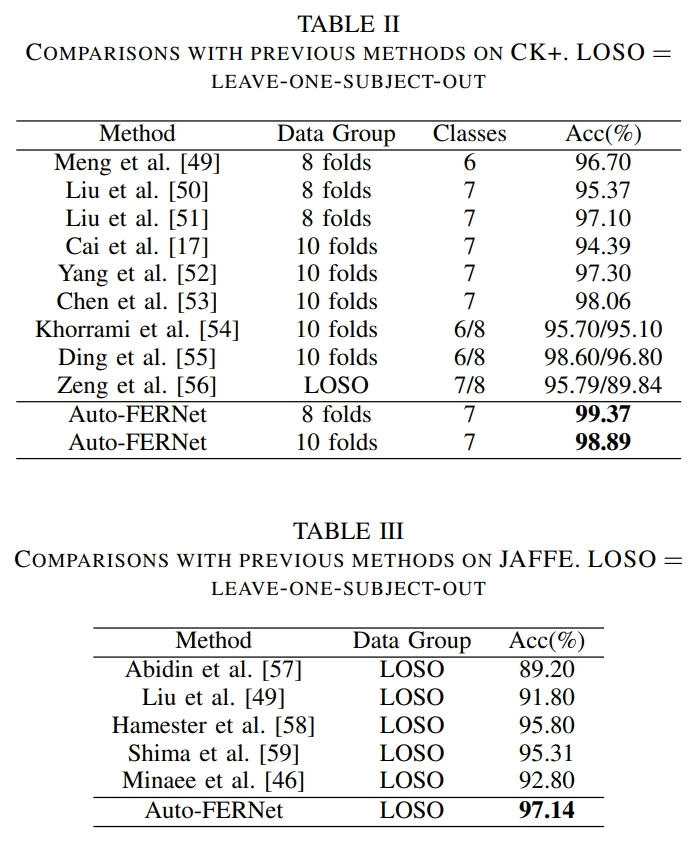

# Auto-FERNet
This is an implementation of the paper ["Auto-FERNet: A Facial Expression Recognition Network With Architecture Search"](https://ieeexplore.ieee.org/abstract/document/9442348).
<div align="center"></div>

## Dataloader
The dataloaders of _FER2013, CK48_ and _JAFFE_ are conducted in `dataloader/dataload_h5.py`.

## Architecture Search
We conduct Neural Achitecture Search (NAS) on _FER2013_ based on [SGAS](https://arxiv.org/abs/1912.00195).

* To search for the best architecture for _FER2013_, run
```angular2html
python train_search.py --batch_size 24 --batch_increase 8 --learning_rate 0.025
```
* The `NAS/model_search.py` and `NAS/operations.py` defines the search space and the candidate operations in each edge.
* The `NAS/architect.py` consists of the computational steps in architecture search.
* The `NAS/genotypes.py` saves the searched architecture. You can add the searched structure into this file manually.

## Retraining on _FER2013_
After search the optimal architecture on _FER2013_, you can retrain the model from scratch and test it by running:
```angular2html
python train_FER2013.py --batch_size 24 --learning_rate 0.025 --layers 12 --auxiliary_weight 0.4
```

## Relabeling
To further improve the performance on _FER2013_ by reducing uncertainty and executing a robust training, load the saved model after retraining and run:
```angular2html
python train_relabel.py --batch_size 64 --learning_rate 0.02272721 --relabel_threshold 0.2 --fes True --fes_threshold 0.03
```

Note that the loaded models are, ideally, the ones saved before totally converged, such as when the training accuracy reaches _85%_ or _90%_. 

The relabeling can be divided into two strategies.
1. The original relabeling based only on the softmax vector
2. The relabeling based on Facial Expression Similarity (FES)

You are free to customize your relabeling strategy by varing the args (relabel_threshold, fes and fes_threshold) in `train_relabel.py`.

## Ensemble
To get an average inference from different models on _FER2013_. You can customize your ensemble models in the array of `model_names` and `--layers` and run:
```angular2html
python ensemble.py --batch_size 64
```

## Fine-tuning on _CK48_ and _JAFFE_
After retraining on _FER2013_, you can fine-tune the saved model on _CK48_ and _JAFFE_ by runing:
```angular2html
python train_CK48.py --batch_size 64 --learning_rate 0.01794073
```
```angular2html
python train_CK48.py --batch_size 16 --learning_rate 0.01794073
```

## Other Tools
More tools for analysis and visualization are involved in the `tools` folder.

## Results
### The searched cells (normal cell and reduction cell):

<div align="center"></div>

### Performance

<div align="center"></div>
<div align="center"></div>

## Citation
If you think our work inspires you, please cite our paper in your work.

Plain Text:
>S. Li et al., "Auto-FERNet: A Facial Expression Recognition Network With Architecture Search," in IEEE Transactions on Network Science and Engineering, vol. 8, no. 3, pp. 2213-2222, 1 July-Sept. 2021, doi: 10.1109/TNSE.2021.3083739.

BibTex:
>@ARTICLE{9442348,  
> author={Li, Shiqian and Li, Wei and Wen, Shiping and Shi, Kaibo and Yang, Yin and Zhou, Pan and Huang, Tingwen},  
> journal={IEEE Transactions on Network Science and Engineering},   
> title={Auto-FERNet: A Facial Expression Recognition Network With Architecture Search},   
> year={2021},  
> volume={8},  
> number={3},  
> pages={2213-2222},  
> doi={10.1109/TNSE.2021.3083739}}
